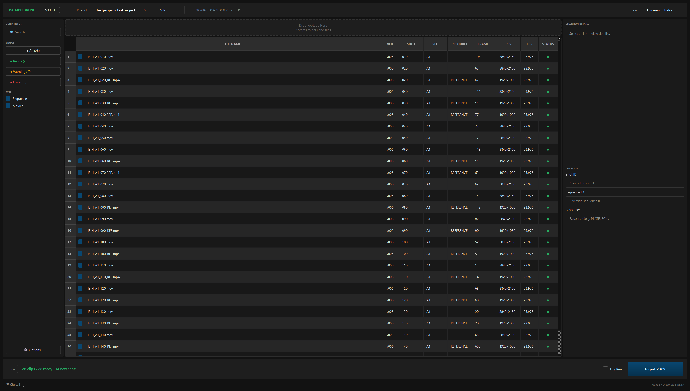

# Ramses-Ingest

Technical ingest tool for [Ramses](https://ramses.rxlab.guide/) production management. Bridges delivery folders to a structured project hierarchy.

## Core Pipeline

1.  **Discovery**: Recursive directory scanning for image sequences and movie files using `pyseq`. Supports all standard VFX formats (EXR, DPX, TIF, MOV, MXF, etc.).
2.  **Matching**: Regex-based identification of Sequence/Shot/Step from filenames or parent directories. Includes a visual "Naming Architect" for building and testing custom rules.
3.  **Probing**: Automatic extraction of resolution, framerate, and start timecode via `ffprobe`.
4.  **Verification**: 
    - Full or "Fast" (First/Mid/Last) MD5 checksum verification for every frame.
    - Missing frame detection for sequences.
    - Duplicate detection (compares frame count and MD5 against existing versions).
    - Standards validation against Ramses project configuration (FPS/Resolution mismatches).
5.  **Ingestion**:
    - **Transactional**: Atomic transfers. Rollback and cleanup on I/O or metadata failure.
    - **Database Integration**: Direct creation and "healing" of Sequence and Shot objects via the Ramses Daemon API.
    - **Standardized Hierarchy**: Files are organized into the `_published/vNNN` structure with standard naming: `{PROJ}_S_{SHOT}_{STEP}.{frame}.{ext}`.
6.  **Previews**: Multi-threaded generation of JPG thumbnails and MP4 proxies with OpenColorIO (OCIO) support.
7.  **Reporting**: Generation of HTML manifests and JSON audit trails for production tracking.

## Technical Details

- **Concurrency**: Parallel processing for I/O-bound tasks (transfers, MD5, metadata probing, and preview generation).
- **Disk Integrity**: Pre-ingest disk space validation and bit-perfect verification.
- **Color Management**: Integrated OCIO support for color-accurate preview generation.
- **Rollback Logic**: Ensures no "zombie" versions are created if an ingest is interrupted.

## Prerequisites

- Python 3.10+
- **FFmpeg/ffprobe** (Must be in system `PATH`)
- **Ramses Client** (Running with active Daemon)

## Installation

```bash
git clone https://github.com/tobkum/Ramses-Ingest.git
cd ramses-ingest
pip install -r requirements.txt
```

## Usage

Launch the GUI:
```bash
python -m ramses_ingest
```



### Typical Workflow
1.  **Scan**: Drag and drop delivery folders.
2.  **Match**: Configure naming rules to extract Shot IDs.
3.  **Audit**: Review technical mismatches (FPS/Res) and missing frames.
4.  **Execute**: Run ingest to move files and register with Ramses.
5.  **Review**: Check the generated HTML manifest for success/failure metrics.

---

Developed by [Overmind Studios](https://www.overmind-studios.de/)
