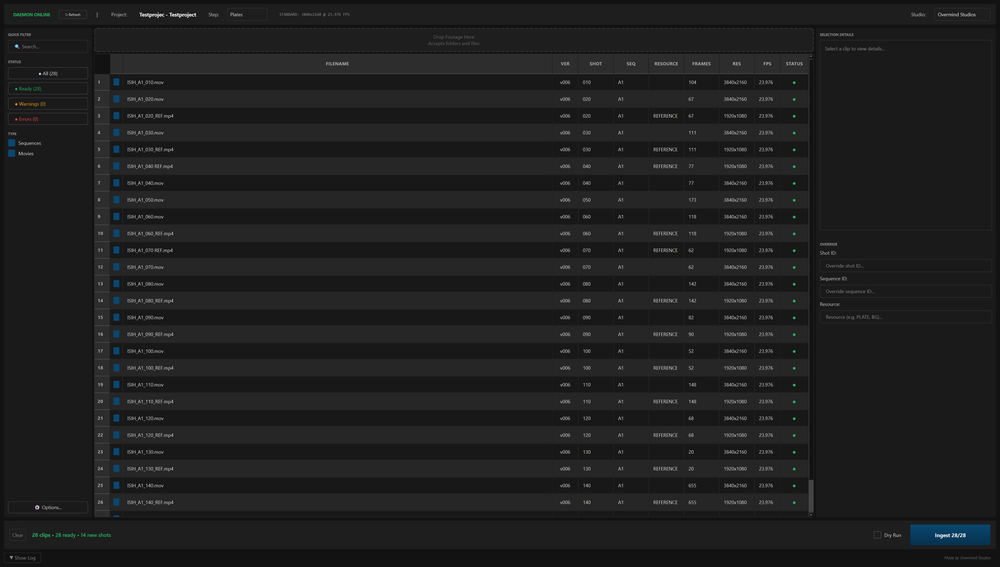

# Ramses-Ingest

Technical ingest tool for [Ramses](https://ramses.rxlab.guide/) production management. Bridges delivery folders to a structured project hierarchy.

## Core Pipeline

1.  **Discovery**: Recursive directory scanning for image sequences and movie files. Supports all standard VFX formats (EXR, DPX, TIF, MOV, MXF, etc.) and both `.` and `_` frame separators.
2.  **Matching**: Regex-based identification of Sequence/Shot/Step from filenames or parent directories. Includes a visual "Naming Architect" for building and testing custom rules.
3.  **Probing**: Automatic extraction of resolution, framerate, and start timecode via `ffprobe`.
4.  **Verification**: 
    - "Fast Verify" (First/Mid/Last sampling) MD5 checksum verification (Enabled by default).
    - Optional full bit-perfect MD5 validation for every frame.
    - Missing frame detection for sequences.
    - Duplicate detection (compares frame count and MD5 against existing versions).
    - Standards validation against Ramses project configuration (FPS/Resolution mismatches).
    - **Warnings vs. errors**: blocking problems (path collisions, duplicates, mixed color primaries) stop a clip from ingesting; soft findings (transfer-function mixes, Res/FPS deviations, frame gaps) are surfaced as warnings but never block.
5.  **Ingestion**:
    - **Transactional**: Atomic transfers. Rollback and cleanup on I/O or metadata failure. Database registration happens **after** the transfer, so a failed copy never leaves orphaned shots or sequences in the database.
    - **Database Integration**: Direct creation and "healing" of Sequence and Shot objects via the Ramses Daemon API. The shot status records **provenance** — version number and a comment ("Ingested v003 from `<delivery folder>` via Ramses-Ingest") visible in the Ramses Client.
    - **Standardized Hierarchy**: Files are organized into the `_published/vNNN` structure with standard naming: `{PROJ}_S_{SHOT}_{STEP}.{frame}.{ext}`. Version numbering also counts version folders created by other tools (e.g. Ramses-Fusion publishes), preventing number collisions.
6.  **Previews**: Multi-threaded generation of JPG thumbnails and MP4 proxies with OpenColorIO (OCIO) support.
7.  **Reporting**: Self-contained HTML manifest with per-clip failure reasons and warnings, a search box with Passed/Warnings/Failed filters, embedded thumbnails, dark/light theme, and a verification badge stating whether checksums are sampled (Fast) or bit-perfect (Full). A machine-readable JSON audit trail is also available.
    - **Project Report**: one client-ready report of *all* footage currently ingested in the project, no matter how many sessions the ingests were spread across. Built from the on-disk state (every published version with an Ingest sidecar), so reverted or re-ingested versions never leave stale rows — plus a machine-readable JSON manifest alongside. Each version shows its own ingest date, live frame-gap check, and checksums. Image sequences are one row each (with frame count and continuity check), never one line per frame.
    - **Delta reports for rolling deliveries**: when a project report already exists, the button offers "new since \<last report\>" — the client gets a report covering only the newly ingested footage. The cutoff is derived from the previous report's filename, so it works across machines with no extra state.
    - **Client-safe by design**: neither the HTML nor the JSON manifest contains internal filesystem paths; the layout is responsive (the table scrolls in place on smaller screens instead of breaking the page).
    - **Ingest ledger**: every session appends one line per clip (incl. failures) to `<project>/_deliveries/ingest_history.log` — the same shared folder Ramses-Out uses for delivery tracking.

## Technical Details

- **Concurrency**: Parallel processing for I/O-bound tasks (transfers, MD5, metadata probing, and preview generation).
- **Disk Integrity**: Pre-ingest disk space validation and bit-perfect verification.
- **Color Management**: Integrated OCIO support for color-accurate preview generation.
- **Rollback Logic**: Ensures no "zombie" versions are created if an ingest is interrupted.

## Prerequisites

- Python 3.10+
- **FFmpeg/ffprobe** (Must be in system `PATH`)
- **Ramses Client** (Running with active Daemon)
- **A Shot Production step in the project** (e.g. `PLATE`) — the Step dropdown
  lists the project's existing steps; Ingest never creates steps. Without one,
  files are still organized on disk but no database status can be written.
  See [WORKFLOW.md](WORKFLOW.md) for the new-project checklist.

## Installation

```bash
git clone https://github.com/tobkum/Ramses-Ingest.git
cd ramses-ingest
pip install -r requirements.txt
```

## Usage

Launch the GUI:
```bash
python -m ramses_ingest
```



### Typical Workflow
1.  **Scan**: Drag and drop delivery folders.
2.  **Match**: Configure naming rules to extract Shot IDs. The table is fully sortable — checkboxes and status dots stay with their rows.
3.  **Audit**: Review technical mismatches (FPS/Res) and missing frames. Right-click selected clips to batch-override Shot/Sequence/Resource, **Colorspace** (curated list incl. ARRI LogC3/LogC4, or type any name from your OCIO config) and **FPS** — image sequences carry no embedded framerate, so the FPS override is the source of truth for validation and the shot duration written to Ramses.
4.  **Execute**: Run ingest to move files and register with Ramses. Plan-editing UI is locked while files transfer.
5.  **Review**: Use **View Report** for the HTML manifest, or **Open Destination** to jump straight to the ingested files (the common parent folder when several shots were ingested).
6.  **Project Report**: At any time (e.g. before a client update), click **Project Report** for a single report covering everything ingested into the project so far — across all sessions and operators. For follow-up deliveries, pick **"New since \<last report\>"** in the same dialog to report only the newly ingested footage.

---

Developed by [Overmind Studios](https://www.overmind-studios.de/)
